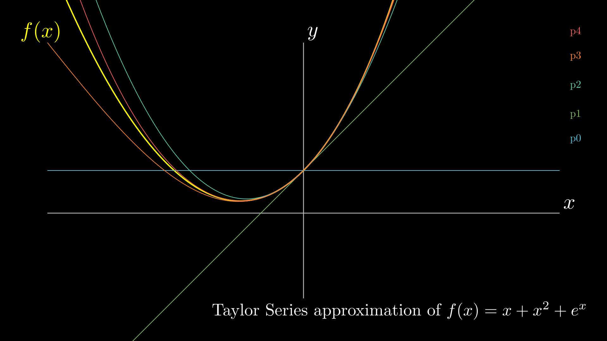

# Taylor Series

Suppose we have an unknown function $f(x)$, but we somehow have access to its derivatives at a certain point. We might then try to **approximate the function near that point using a polynomial expansion**.  
The idea is that if our polynomial matches not only the value of $f$ but also some of its derivatives at that point, it can locally mimic the behavior of $f$ quite well.

### Polynomial Approximations Around $x = 0$

Let’s start by approximating $f(x)$ around the point $x = 0$.

- **Zeroth-order approximation (degree 0):**

  $$
  p(x) = f(0)
  $$

  This is a constant approximation — clearly very crude, but it matches $f(x)$ at $x = 0$.

- **First-order approximation (degree 1):**

  We now require that our polynomial $p(x)$ also matches the first derivative of $f$ at 0:

  $$
  p(0) = f(0), \quad p'(0) = f'(0)
  $$

  The simplest polynomial satisfying these conditions is:

  $$
  p(x) = f(0) + f'(0)x
  $$

  This gives us the **tangent line** to $f$ at $x = 0$.

- **Second-order approximation (degree 2):**

  We now add a quadratic term and require that $p''(0) = f''(0)$:

  $$
  p(x) = f(0) + f'(0)x + \frac{1}{2}f''(0)x^2
  $$

  Checking the derivatives:

  $$
  p'(x) = f'(0) + f''(0)x \Rightarrow p'(0) = f'(0)
  $$

  $$
  p''(x) = f''(0) \Rightarrow p''(0) = f''(0)
  $$

  So this quadratic polynomial matches $f$, $f'$, and $f''$ at $x = 0$.

### The General Pattern

Continuing this process indefinitely gives the **Maclaurin series**, which is just a Taylor series expanded around $x = 0$:

$$
p(x) = f(0) + f'(0)x + \frac{f''(0)}{2!}x^2 + \frac{f^{(3)}(0)}{3!}x^3 + \dots + \frac{f^{(n)}(0)}{n!}x^n + \dots
$$

This provides an increasingly accurate local approximation of $f(x)$ as more terms are added.

### Taylor Series Around an Arbitrary Point $x = c$

If instead we want to approximate $f(x)$ around some point $x = c$, we shift the expansion:

$$
p(x) = f(c) + f'(c)(x - c) + \frac{f''(c)}{2!}(x - c)^2 + \frac{f^{(3)}(c)}{3!}(x - c)^3 + \dots
$$

or more compactly:

$$
p(x) = \sum_{n=0}^{\infty} \frac{f^{(n)}(c)}{n!} (x - c)^n
$$

This is the **Taylor series** of $f$ around $x = c$.  
It represents how we can reconstruct the local behavior of $f$ using its derivatives, which will be crucial when we approximate derivatives numerically (e.g. in finite-difference schemes).
