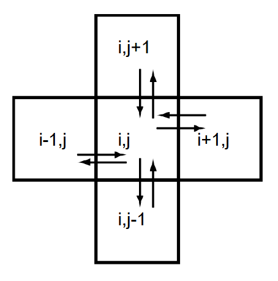

# Diffuse Bad

## Summary of Stam’s Explanation

In Stam’s paper, the **diffusion step** accounts for the way density spreads across the grid at a certain rate, `diff`. When `diff > 0`, density will naturally distribute among neighboring cells. Each cell exchanges density with its four direct neighbors — left, right, top, and bottom.



For each cell, the net density change can be approximated by:

$$
x_0[IX(i-1,j)] + x_0[IX(i+1,j)] + x_0[IX(i,j-1)] + x_0[IX(i,j+1)] - 4x_0[IX(i,j)]
$$

A basic diffusion solver computes this exchange for every cell and adds it to the existing value, resulting in an implementation like this:

```c
void diffuse_bad ( int N, int b, float *x, float *x0, float diff, float dt ) {
    int i, j;
    float a = dt * diff * N * N;
    for ( i = 1 ; i <= N ; i++ ) {
        for ( j = 1 ; j <= N ; j++ ) {
            x[IX(i,j)] = x0[IX(i,j)] + a * (
                x0[IX(i-1,j)] + x0[IX(i+1,j)] +
                x0[IX(i,j-1)] + x0[IX(i,j+1)] -
                4 * x0[IX(i,j)]
            );
        }
    }
    set_bnd(N, b, x);
}
```

The routine `set_bnd()` handles the boundary cells, which will be discussed later.

## Understanding the Diffusion Equation

If we only account for **density diffusion**, we obtain the following partial differential equation:

$$
\frac{\partial p}{\partial t} = k \nabla^2 p
$$

This is a famous equation — it’s equivalent to the **heat equation** for a constant diffusion rate $k$.  
From Wikipedia: “It describes the macroscopic behavior of many micro-particles in Brownian motion, resulting from the random movements and collisions of the particles.”

It sounds cool, whatever that means.

The **Laplacian operator** $\nabla^2$ essentially measures _how much a point differs from its surrounding neighbors_. Personally, I like to think of it as the **divergence of the gradient** (it can be written $\nabla \cdot \nabla f$).

Given a scalar field of density, the **gradient** gives us a vector field where the vectors point in the direction of greatest increase — away from low-density areas and toward higher-density ones. The **divergence** measures how much "outflow" there is at a point:

- Negative divergence → more flow entering than leaving (the region becomes denser).
- Positive divergence → more flow leaving than entering (the region loses density).
- Zero divergence → flow is balanced.

So, the **Laplacian**, analogous to a second derivative, will be positive where flow is diverging (losing density) and negative where it’s converging (gaining density). It tells us how “peaky” or “valley-like” a point is in the field.

Looking again at our PDE:

$$
\frac{\partial p}{\partial t} = k \nabla^2 p
$$

I don’t know how it was originally derived, but intuitively, it says: _the rate of change of density over time depends on how density spreads across space._ Points with higher density will naturally flow toward areas with lower density.

(There’s a great 3Blue1Brown video that visually explains this beautifully: [Diffusion equation](https://www.youtube.com/watch?v=ly4S0oi3Yz8&t=536s))

## Solving the Diffusion Equation

What we care about is: given some density $p$ at time step $t$, how do we find the density at $t + \Delta t$?

For this, we use the simplest numerical integrator — the **explicit Forward Euler method**.

From the definition of the derivative:

$$
\frac{dx}{dt} = \lim_{\Delta t \to 0} \frac{x(t+\Delta t) - x(t)}{\Delta t}
$$

We approximate it using a small time step $\Delta t$:

$$
\frac{dx}{dt} \approx \frac{x(t+\Delta t) - x(t)}{\Delta t}
$$

Rearranging, we get our update rule:

$$
x(t+\Delta t) = x(t) + \Delta t \frac{dx}{dt}
$$

In our case, we don’t directly know $\frac{dp}{dt}$, but our diffusion equation tells us:

$$
\frac{dp}{dt} = k \nabla^2 p
$$

Since the Laplacian of the density field, $\nabla^2 p$, is only dependent on the density itself, we just need a way to compute it.

## Discretizing the Laplacian

The Laplacian operator can be expanded as:

$$
\nabla^2 f = \frac{\partial^2 f}{\partial x^2} + \frac{\partial^2 f}{\partial y^2}
$$

We can discretize the second derivative using the **central difference formula** (see background section on numerical differentiation):

$$
\frac{d^2 f}{dx^2} \approx \frac{f(x+h) - 2f(x) + f(x-h)}{h^2}
$$

Substituting into the Laplacian, we get:

$$
\nabla^2 f \approx \frac{f(x+h, y) - 2f(x, y) + f(x-h, y)}{h_x^2} + \frac{f(x, y+h) - 2f(x, y) + f(x, y-h)}{h_y^2}
$$

Since we’re using a square grid ($h_x = h_y = h$), this simplifies to:

$$
\nabla^2 f \approx \frac{f(x+h, y) + f(x-h, y) + f(x, y+h) + f(x, y-h) - 4f(x, y)}{h^2}
$$

Notice how this matches exactly the expression Stam uses for the diffusion process.  
It doesn’t come out of thin air — it’s the result of combining several deep mathematical concepts into something surprisingly simple and elegant.

## Putting It All Together

Our update rule for a single cell becomes:

$$
p(t + \Delta t) = p(t) + \Delta t k \frac{p(x+h, y) + p(x-h, y) + p(x, y+h) + p(x, y-h) - 4p(x, y)}{h^2}
$$

This looks almost identical to Stam’s pseudo-code.  
The only detail to note is that $h$ is the cell size — since each cell has constant density, we must look at neighboring cells to estimate the spatial derivative.

Stam combines $\Delta t$, $k$, and $1/h^2$ into a single constant (the variable `a` in his code). Because this value doesn’t change during each iteration (or frame), it can be computed once and reused:

$$
a = \Delta t * k * N^2
$$

Here, we assume the grid size is 1, so $h = 1/N$ and $1/h^2 = N^2$.

That’s it — that’s all you need to understand the **diffusion step** of the simulation. Rejoice!

To experiment with the simulation below, click and drag on the grid to set density values. You’ll find:

- a _Play/Pause_ button,
- a _Step_ button (advances the simulation one step),
- a _Refresh_ button (resets all densities to zero), and
- a slider to control the diffusion coefficient $k$.

<script src="https://cdnjs.cloudflare.com/ajax/libs/p5.js/1.9.0/p5.min.js"></script>
<div id="diffusion-bad" class="sketch-container"></div>
<script type="module">
  import { createFluidSim } from "./scripts/fluid-sketch.js";
  createFluidSim("diffusion-bad", { useDiffuseBad: true });
</script>
