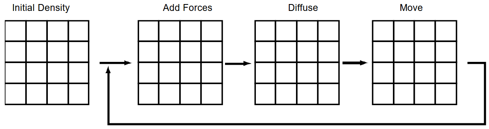

# Moving Densities

Stam starts by focusing on the simpler of the two equations — the one describing how a **density field** moves through a fixed **velocity field** (i.e., assuming the velocity doesn’t change with time).

The density equation:

$$
\frac{\partial \rho}{\partial t} = -(\mathbf{u} \cdot \nabla)\rho + k \nabla^2 \rho + S
$$

Each term on the right-hand side contributes differently to how the density evolves:

- The first term means the density follows the velocity field — it gets _advected_.
- The second term represents _diffusion_, how density spreads out over time.
- The third term adds _sources_, meaning new density gets introduced into the system.

Stam’s solver tackles these three effects every time step, but in reverse order:  
first adding sources, then diffusing, and finally advecting the density through the velocity field.

The source term is the simplest to handle — for each cell, the new density is increased by the amount added by sources during the time step $dt$; In my implementation I simply set the density at the clicked grid cell to 1.

That’s the first building block — adding density into the world. The interesting behavior comes next, when the density starts to move and spread.

- [Diffusion Bad](diffusion-bad.md)
- [Diffusion Good](diffuse-good.md)
- [Following Velocity]
